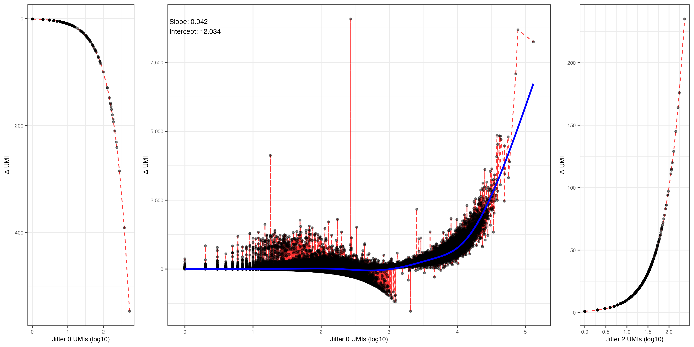

# scarecrow

This repo contains R code used in the analysis presented in the [scarecrow](https://github.com/MorganResearchLab/scarecrow) paper. Several of the QC steps are borrowed from the Pachter lab kallisto [tutorial](https://pachterlab.github.io/kallistobustools/tutorials/kb_building_atlas/R/kb_analysis_0_R/).

## Libraries and functions

```R
library(Seurat)
library(Matrix)
library(tidyverse)
library(patchwork)
library(ggpubr)
library(ggdist)
library(ggpointdensity)
library(viridis)
library(scales)
library(ggpmisc)

# Slightly modified from BUSpaRse, just to avoid installing a few dependencies not used here
read_count_output <- function(dir, name) {
  dir <- normalizePath(dir, mustWork = TRUE)
  m <- readMM(paste0(dir, "/", name, ".mtx"))
  m <- Matrix::t(m)
  m <- as(m, "CsparseMatrix")
  # The matrix read has cells in rows
  ge <- ".genes.txt"
  genes <- readLines(file(paste0(dir, "/", name, ge)))
  barcodes <- readLines(file(paste0(dir, "/", name, ".barcodes.txt")))
  colnames(m) <- barcodes
  rownames(m) <- genes
  return(m)
}

# Returns a tibble with total UMI counts for each barcode, and
# rank of the total counts, with number 1 for the barcode with the most counts.
get_knee_df <- function(mat) {
  total <- rank <- NULL
  tibble(total = Matrix::colSums(mat),
         rank = row_number(desc(total))) %>%
    distinct() %>%
    dplyr::filter(total > 0) %>%
    arrange(rank)
}

# Minimum total UMI counts for barcode for it to be considered when calculating the inflection point;
# this helps to avoid the noisy part of the curve for barcodes with very few counts.
get_inflection <- function(df, lower = 100) {
  log_total <- log_rank <- total <-  NULL
  df_fit <- df %>%
    dplyr::filter(total >= lower) %>%
    transmute(log_total = log10(total),
              log_rank = log10(rank))
  d1n <- diff(df_fit$log_total)/diff(df_fit$log_rank)
  right.edge <- which.min(d1n)
  10^(df_fit$log_total[right.edge])
}

# Plot a transposed knee plot, showing the inflection point and
# the number of remaining cells after inflection point filtering. It's
# transposed since it's more generalizable to multi-modal data. Taken from the
# BUSpaRse package.
knee_plot <- function(df, inflection, fontsize=10) {
  total <- rank_cutoff <- NULL
  annot <- tibble(inflection = inflection, rank_cutoff = max(df$rank[df$total > inflection]))
  ggplot(df, aes(total, rank)) + geom_path() +
    geom_vline(aes(xintercept = inflection), data = annot, linetype = 2, color = "gray40") +
    geom_hline(aes(yintercept = rank_cutoff), data = annot, linetype = 2, color = "gray40") +
    geom_text(aes(inflection, rank_cutoff, label = paste(rank_cutoff, "'cells'")), data = annot, vjust = 1, size=3) +
    scale_x_log10(labels = label_comma()) + scale_y_log10(labels = label_comma()) +
    labs(y = "Rank", x = "Total UMIs") +
    annotation_logticks() & theme_bw() &
    theme(text = element_text(size=fontsize))
}

# Plot PCT genes
plot_pct_genes <- function(mat, tr2g, top_n = 20, symbol = "ensembl", fontsize=10) {
  pct_tx <- rowSums(mat)
  gs <- rownames(mat)[order(-pct_tx)]
  df <- as.data.frame(t(mat[gs[1:top_n],]))
  df <- df %>%
    mutate_all(function(x) x/colSums(mat)) %>%
    pivot_longer(everything(), names_to = "gene")
  if (symbol == "ensembl") {
    df <- left_join(df, tr2g, by = "gene")
  } else {
    df <- rename(df, gene_name = gene)
  }
  df %>%
    mutate(gene = fct_reorder(gene_name, value, .fun = median)) %>%
    ggplot(aes(gene, value)) +
    geom_boxplot() +
    labs(x = "", y = "Proportion of total counts") +
    coord_flip() +
    theme_bw() + theme(text = element_text(size=fontsize))
}

# Contants
fontsize <- 8
setwd("~/Documents/scarecrow/results")
```

## Import transcript to gene table

This is taken from the `kallisto` genome indices.

```R
# Load gene to transcript data
tr2g <- read_tsv("~/Documents/scarecrow_test/results/transcripts_to_genes.txt", col_names = c("transcript", "gene", "gene_name"))
tr2g <- distinct(tr2g[, c("gene", "gene_name")])
tr2g[is.na(tr2g$gene_name),]$gene_name <- tr2g[is.na(tr2g$gene_name),]$gene
# uniquify the duplicates (some ensembl gene IDs map to the same gene symbol)
gene_name_dups <- tr2g$gene_name[which(duplicated(tr2g$gene_name))]
for(n in gene_name_dups) {
  tr2g[which(tr2g$gene_name == n),]$gene_name <- paste(tr2g[which(tr2g$gene_name == n),]$gene_name, tr2g[which(tr2g$gene_name == n),]$gene, sep="-")
}
```

### Import kallisto counts matrices

After generating count matrices for each dataset with `kallisto` under different `scarecrow` jitter settings, the `counts_unfiltered/cells*` are read into a list and named.

```R
raw <- list(read_count_output("~/Documents/scarecrow/results/Parse-WTv2/J0/kallisto/counts_unfiltered", name = "cells_x_genes"),
            read_count_output("~/Documents/scarecrow/results/Parse-WTv2/J1/kallisto/counts_unfiltered", name = "cells_x_genes"),
            read_count_output("~/Documents/scarecrow/results/Parse-WTv2/J2/kallisto/counts_unfiltered", name = "cells_x_genes"))
names(raw) <- c("Parse-WTv2-J0", "Parse-WTv2-J1", "Parse-WTv2-J2")
```

## Processing count matrices

After importing the data, we apply a series of steps to the list of count matrices. These steps are based on the `kallisto` tutorial linked at the start of the page. Briefly, we (1) test of library saturation; (2) generate a knee plot to identify the inflection point in barcode count; (3) filter each count matrix based on its inflection point and return a `Seurat` object; (4) plot mtDNA fraction and RNA counts;  (5) filter data to retain cells whose mtDNA content is below the 99th percentile. The filtering applied here is very rudimentary.

```R
# Test for library saturation
libsat <- lapply(raw, function(res_mat) {
  tot_counts <- colSums(res_mat)
  lib_sat <- tibble(nCount = tot_counts, nGene = colSums(res_mat > 0))

  p1 <- ggplot(lib_sat, aes(nCount, nGene)) +
    geom_pointdensity(size=1, adjust=2) + scale_color_viridis(name="density\n(neighbours)", labels = label_comma()) +
    scale_x_log10(labels = label_comma()) + scale_y_log10(labels = label_comma()) + annotation_logticks() +
    xlab("Number of molecules") + ylab("Number of features") +
    theme_bw() + theme(text = element_text(size=fontsize), legend.position = "right")
  return(list(p1 = p1))
})

# Knee plot for inflection point in barcode count
knees <- lapply(raw, function(res_mat) {
  knee_df <- get_knee_df(res_mat)
  inflection <- get_inflection(knee_df, lower=100)
  return(list(inflection = inflection, knee_plot = knee_plot(knee_df, inflection, fontsize=fontsize)))
})

# Filter and return Seurat Object
mats <- lapply(1:length(raw), function(i) {
  res_mat <- raw[[i]][, colSums(raw[[i]]) > knees[[i]]$inflection]
  res_mat <- res_mat[Matrix::rowSums(res_mat) > 0,]
  tmp <- rownames(res_mat)
  rownames(res_mat) <- tr2g$gene_name[match(rownames(res_mat), tr2g$gene)]
  rownames(res_mat)[which(is.na(rownames(res_mat)))] <- tmp[which(is.na(rownames(res_mat)))]
  CreateSeuratObject(counts = res_mat, project = names(raw)[i], min.cells = 1, min.features = 1)
})

# Plot mt percent and nCount_RNAs
mt_pct <- lapply(mats, function(dat) {
  dat[["percent.mt"]] <- PercentageFeatureSet(dat, pattern = "^MT-")
  p1a <- ggplot(data.frame(X=dat$nFeature_RNA), aes(y=X, slab_color = after_stat(y))) +
    stat_slabinterval(side = "right", lty=0) +
    stat_dotsinterval(slab_shape = 19, quantiles =100, side="left") +
    scale_color_distiller(aesthetics = "slab_color", guide = "colorbar2") +
    ylab("Features per cell") +
    scale_y_continuous(labels = label_comma()) +
    theme_bw() + theme(text = element_text(size=fontsize),
                       axis.text.y = element_blank(), axis.title.y = element_blank(),
                       legend.position = "None") + coord_flip() +
    theme(plot.margin = margin(l = 0.75, r = 0.5, unit = "cm"))

  p1b <- ggplot(data.frame(X=dat$nCount_RNA), aes(y=X, slab_color = after_stat(y))) +
    stat_slabinterval(side = "right", lty=0) +
    stat_dotsinterval(slab_shape = 19, quantiles =100, side="left") +
    scale_color_distiller(aesthetics = "slab_color", guide = "colorbar2") +
    ylab("Molecules per cell") +
    scale_y_continuous(labels = label_comma()) +
    theme_bw() + theme(text = element_text(size=fontsize),
                       axis.text.y = element_blank(), axis.title.y = element_blank(),
                       legend.position = "None") + coord_flip() +
    theme(plot.margin = margin(l = 0.75, r = 0.5, unit = "cm"))
  p1c <- ggplot(data.frame(X=dat$percent.mt), aes(y=X, slab_color = after_stat(y))) +
    stat_slabinterval(side = "right", lty=0) +
    stat_dotsinterval(slab_shape = 19, quantiles =100, side="left") +
    scale_color_distiller(aesthetics = "slab_color", guide = "colorbar2") +
    ylab("% mitochondrial genes") +
    theme_bw() + theme(text = element_text(size=fontsize),
                       axis.text.y = element_blank(), axis.title.y = element_blank(),
                       legend.position = "None") + coord_flip() +
    theme(plot.margin = margin(l = 0.75, r = 0.5, unit = "cm"))
  p1 <- ggarrange(p1a,p1b,p1c,nrow=3)

  p2 <- ggplot(data.frame(X=dat$nCount_RNA, Y=dat$percent.mt), aes(x=X, y=Y)) +
    geom_pointdensity(size=1, adjust=5) + scale_color_viridis(name="density\n(neighbours)", labels = label_comma()) +
    xlab("Molecules per cell") + ylab("% mitochondrial genes") +
    scale_x_continuous(labels = label_comma()) +
    geom_hline(yintercept=quantile(dat$percent.mt,.99), lty=2) +
    annotate("text", x=max(dat$nCount_RNA)/2, y=quantile(dat$percent.mt,.99), hjust=0, vjust=-1, size=3, label = "99th percentile") +
    theme_bw() + theme(text = element_text(size=fontsize), legend.position = "right")

  p3 <- ggplot(data.frame(X=dat$nCount_RNA, Y=dat$nFeature_RNA), aes(x=X, y=Y)) +
    geom_pointdensity(size=1, adjust=5) + scale_color_viridis(name="density\n(neighbours)", labels = label_comma()) +
    xlab("Molecules per cell") + ylab("Features per cell") +
    scale_x_continuous(labels = label_comma()) + scale_y_continuous(labels = label_comma()) +
    geom_hline(yintercept=quantile(dat$nFeature_RNA,.99), lty=2) +
    geom_vline(xintercept=quantile(dat$nCount_RNA,.99), lty=2) +
    annotate("text", x=max(dat$nCount_RNA)/2, y=quantile(dat$nFeature_RNA,.99), hjust=0, vjust=-1, size=3, label = "99th percentile") +
    theme_bw() + theme(text = element_text(size=fontsize), legend.position = "None")

  return(list(p1 = p1, p2 = p2, p3 = p3))
})

# Apply filter and normalize
mats_filtered <- lapply(mats, function(dat) {
  dat[["percent.mt"]] <- PercentageFeatureSet(dat, pattern = "^MT-")
  dat <- subset(dat, subset = percent.mt < quantile(dat$percent.mt,.99))
  NormalizeData(dat, normalization.method = "LogNormalize", scale.factor = 10000)
})
```

### Plotting the processing results

We generate multi-panel plots to illustrate some of the results from the above steps as follows.

```R
for(i in 1:length(raw)){
  ggarrange(ggarrange(libsat[[i]]$p1, knees[[i]]$knee_plot, widths=c(4,4), labels=c("A", "B"), nrow=1),
            ggarrange(mt_pct[[i]]$p1, mt_pct[[i]]$p2, widths=c(3,5), labels=c("C", "D"), nrow=1),
            nrow=2) %>%
    ggsave(width = 8, height = 6, units="in", dpi=300, filename = paste0("plots/", names(raw)[i], "_kallisto.png"))
}
```

Below is an example, showing the plot generated from the Parse data at jitter 2.


Panel A shows a library saturation plot, with points coloured according to the density of neighbouring points. Note that there is a high density of points with a single feature and molecule, these correspond to near empty droplets. Panel B shows a knee plot, indicating the inflection point for cells that have at least 100 UMIs, the total number of which is indicated on the plot. Panel C shows raindcloud plots to illustrate the distributions of the number of features per cell, the number of molecules per cell, and the percentage of mitochondrial (mt) genes per cell. These distributions are calcualted after filtering to retain cells with UMI counts exceeding the inflection point. Panel D presents a density scatter plot of UMI count against mt gene content for features, with the 99th percentile of mt gene content indicated with a dashed line.

Next we compare the mean and median counts per gene between two sets of results. In the below code we compare the first list element to the last, which for the Parse data results is comparing jitter 0 to jitter 2.

```R
# Function to calculate row-wise stats of dgCMatrix
rowstats_dgCMatrix <- function(dgCMatrix) {
  # Convert to triplet form (i,j,x)
  mat_triplet <- summary(dgCMatrix)

  # Convert character '.' to NA if they exist
  if (is.character(mat_triplet$x)) {
    mat_triplet$x[mat_triplet$x == "."] <- NA
    mat_triplet$x <- as.numeric(mat_triplet$x)
  }

  # Filter for non-zero, non-NA values
  valid_values <- mat_triplet[mat_triplet$x != 0 & !is.na(mat_triplet$x), ]

  # Initialize result vector with NAs
  medians <- rep(NA_real_, nrow(dgCMatrix))
  means <- rep(NA_real_, nrow(dgCMatrix))
  min_count <- rep(NA_real_, nrow(dgCMatrix))
  max_count <- rep(NA_real_, nrow(dgCMatrix))

  if (nrow(valid_values) > 0) {
    # Split values by row index
    values_by_row <- split(valid_values$x, valid_values$i)
    # Calculate median for each row with valid values
    row_medians <- vapply(values_by_row, median, numeric(1))
    # Calculate mean for each row with valid values
    row_means <- vapply(values_by_row, mean, numeric(1))
    row_min <- vapply(values_by_row, min, numeric(1))
    row_max <- vapply(values_by_row, max, numeric(1))
    # Insert results at the correct row positions
    medians[as.integer(names(row_medians))] <- row_medians
    means[as.integer(names(row_means))] <- row_means
    min_count[as.integer(names(row_min))] <- row_min
    max_count[as.integer(names(row_max))] <- row_max
  }

  return(data.frame(gene=rownames(dgCMatrix), mean=means, median=medians, min=min_count, max=max_count))
}
a <- rowstats_dgCMatrix(mats_filtered[[1]]@assays$RNA$counts)
b <- rowstats_dgCMatrix(mats_filtered[[length(mats_filtered)]]@assays$RNA$counts)
tmp <- merge(a, b, by="gene")

p1 <- ggplot(tmp, aes(x=log(mean.x), y=log(mean.y))) + geom_pointdensity(size=1, adjust=0.5) +
  scale_color_viridis(name="Density\n(neighbours)", labels = label_comma()) +
  xlab("Jitter 0 mean count per gene (log10)") + ylab(paste0("Jitter ", length(raw)-1, " mean count per gene (log10)")) +
  geom_abline(colour="red", lty=2) +
  annotate("label", x = Inf, y = Inf, hjust = 1.1, vjust = 1.1, fill = "white", alpha = 0.7, size = 3,
           label = paste("Above abline:", sum(tmp$mean.y > tmp$mean.x, na.rm=T),
                         "\nBelow abline:", sum(tmp$mean.y < tmp$mean.x, na.rm=T))) +
  theme_bw() + theme(text = element_text(size=fontsize), legend.position = "right")
p2 <- ggplot(tmp, aes(x=log(max.x), y=log(max.y))) + geom_pointdensity(size=1, adjust=0.5) +
  scale_color_viridis(name="Density\n(neighbours)", labels = label_comma()) +
  xlab("Jitter 0 max count per gene (log10)") + ylab(paste0("Jitter ", length(raw)-1, " max count per gene (log10)")) +
  geom_abline(colour="red", lty=2) +
  annotate("label", x = Inf, y = Inf, hjust = 1.1, vjust = 1.1, fill = "white", alpha = 0.7, size = 3,
           label = paste("Above abline:", sum(tmp$max.y > tmp$max.x, na.rm=T),
                         "\nBelow abline:", sum(tmp$max.y < tmp$max.x, na.rm=T))) +
  theme_bw() + theme(text = element_text(size=fontsize), legend.position = "right")

ggarrange(p1,p2, labels=c("A", "B"), nrow=2, common.legend = T, legend = "right") %>%
  ggsave(width = 4, height = 6, units="in", dpi=300, bg = "white",
         filename = paste0("plots/", names(raw)[1], "-", names(raw)[length(raw)], "_counts.png"))
```

This returns the following image:


## Barcode count gains

The `combined_CB_counts.txt` file output by `scarecrow stats` can be analysed to plot barcode count gains under different jitter settings. In the below example we import the Parse jitter 0 and jitter 2 data.

```R
library(mgcv)

file_a <- read.table("~/Documents/scarecrow_test/results/Parse-WTv2/J0/SRR28867558_1_trimmed.fastq.combined_CB_counts.txt")
file_b <- read.table("~/Documents/scarecrow_test/results/Parse-WTv2/J2/SRR28867558_1_trimmed.fastq.combined_CB_counts.txt")

dataset <- "Parse"
jitter <- c(0,2) # set labels for jitter values of data

dat <- merge(file_a, file_b, by="V1", all=T)
dat[is.na(dat)] <- 0
dat$diff <- dat$V2.y-dat$V2.x
dat$set <- "Intersect"
dat[which(dat$V2.y == 0),]$set <- paste0("J", jitter[1])
dat[which(dat$V2.x == 0),]$set <- paste0("J", jitter[2])
dat$set <- factor(dat$set, levels=c(paste0("J", jitter[1]), "Intersect", paste0("J", jitter[2])))

p1 <- ggplot(dat[which(dat$set==paste0("J", jitter[1])),], aes(x=log10(V2.x), y=diff)) +
  geom_line(colour="red", lty=2, alpha=0.8) + geom_point(size=1, alpha=0.5) +
  xlab(paste("Jitter", jitter[1], "UMIs (log10)")) + ylab("Δ UMI") +
  scale_x_continuous(labels = label_comma()) + scale_y_continuous(labels = label_comma()) +
  theme_bw() + theme(text = element_text(size=fontsize), legend.position = "bottom")

# BAM (big additive model)
fit <- bam(diff ~ V2.x + s(V2.x, bs = "tp"), data = dat[which(dat$set=="Intersect"),])
p2 <- ggplot(dat[which(dat$set=="Intersect"),], aes(x=log10(V2.x), y=diff)) +
  geom_line(colour="red", lty=2, alpha=0.8) + geom_point(size=1, alpha=0.5) +
  geom_smooth(method = "bam", formula = y ~ x + s(x, bs="tp"), color = "blue") +
  xlab(paste("Jitter", jitter[1], "UMIs (log10)")) + ylab("Δ UMI") +
  annotate("text", x = -Inf, y = max(dat[which(dat$set=="Intersect"),]$diff),
           label = sprintf("\tSlope: %.3f\n\tIntercept: %.3f", coef(fit)["V2.x"], coef(fit)["(Intercept)"]),
           hjust = 0, vjust = 1, size = 3) +
  scale_x_continuous(labels = label_comma()) + scale_y_continuous(labels = label_comma()) +
  theme_bw() + theme(text = element_text(size=fontsize), legend.position = "bottom")

p3 <- ggplot(dat[which(dat$set==paste0("J", jitter[2])),], aes(x=log10(V2.y), y=diff)) +
  geom_line(colour="red", lty=2, alpha=0.8) + geom_point(size=1, alpha=0.5) +
  xlab(paste("Jitter", jitter[2], "UMIs (log10)")) + ylab("Δ UMI") +
  scale_x_continuous(labels = label_comma()) + scale_y_continuous(labels = label_comma()) +
  theme_bw() + theme(text = element_text(size=fontsize), legend.position = "bottom")

ggarrange(p1,p2,p3, nrow=1, common.legend=F, widths=c(1,3,1)) %>%
  ggsave(width = 12, height = 6, units="in", dpi=300, filename = paste0("plots/", dataset, "_", jitter[1], "-", jitter[2], "_UMIs.png"))
```

This results in the following plot:



The plots show log10 UMI counts on the x axis and the difference in UMI count (jitter 2 - jitter 1) for the same barcode on the y axis. The left panel shows barcodes identified only at jitter 0, the middle panel shows barcodes identified in both datasets, and the right panel shows barcodes identified only at jitter 2. The negative difference in UMI counts in the intersect implies the re-assignment of reads to different barcodes at jitter 2 relative to jitter 0.


## k-Nearest neighbours

Starting, for example, from the Parse raw data for jitter 0 and 2, we apply basic filtering to retain cells and features with at least 100 counts each. We then subset the two matrices to retain cells with shared barcodes between both sets of data.

raw <- list(read_count_output("./kallisto/J0M2/SRR28867558_1_trimmed/counts_unfiltered", name = "cells_x_genes"),
            read_count_output("./kallisto/J2M2/SRR28867558_1_trimmed/counts_unfiltered", name = "cells_x_genes"))

```R
raw <- list(read_count_output("~/Documents/scarecrow/results/Parse-WTv2/J0/kallisto/counts_unfiltered", name = "cells_x_genes"),
            read_count_output("~/Documents/scarecrow/results/Parse-WTv2/J2/kallisto/counts_unfiltered", name = "cells_x_genes"))
names(raw) <- c("Parse-WTv2-J0", "Parse-WTv2-J2")

mats <- lapply(1:length(raw), function(i) {
  res_mat <- raw[[i]][, colSums(raw[[i]]) > 99]
  res_mat <- res_mat[Matrix::rowSums(res_mat) > 99,]
})

barcodes <- colnames(mats[[1]])[colnames(mats[[1]]) %in% colnames(mats[[2]])]
genes <- rownames(mats[[1]])[rownames(mats[[1]]) %in% rownames(mats[[2]])]
mats[[1]] <- mats[[1]][genes, barcodes]
mats[[2]] <- mats[[2]][genes, barcodes]
```

We use the `FNN` library's `get.knn` function to identify the nearest neighbours for a range of *k* values (2:10, 20, 30, 50) for each matrix.

```R
knn_results <- lapply(c(2:10,20,30,50), function(k) lapply(mats, function(m) FNN::get.knn(as.matrix(t(m)), k = k)) )
```

This can take a while, so you may wish to save the object afterward so that it can just reloaded in the future without having to re-run the analysis.

```R
save(knn_results, file="Parse_knn_results.RData")
load("Parse_knn_results.RData")
```

After calculating kNN for each matrix, we can calculate the proportion of shared and identical neighbours identified across both datasets for each cell.

```R
knn_props <- lapply(1:length(knn_results), function(k) {
  knn_shared <- do.call("rbind", lapply(1:nrow(knn_results[[k]][[1]]$nn.index), function(i) {
      sum(knn_results[[k]][[1]]$nn.index[i,] %in% knn_results[[k]][[2]]$nn.index[i,])
    } ))
  knn_identical <- do.call("rbind", lapply(1:nrow(knn_results[[k]][[1]]$nn.index), function(i) {
      sum(knn_results[[k]][[1]]$nn.index[i,] == knn_results[[k]][[2]]$nn.index[i,])
    } ))
  return(data.frame(k = dim(knn_results[[k]][[1]]$nn.index)[2],
                    shared = knn_shared/dim(knn_results[[k]][[1]]$nn.index)[2],
                    identical = knn_identical/dim(knn_results[[k]][[1]]$nn.index)[2]))
})
knn_props <- do.call("rbind", knn_props)
```

Next we collapse the data into a format that can be more easily plotted with ggplot. We add a small amount of noise to the k value so that the points do not stack in thin vertical lines. We also allocate separate facets for values at k > 10, to avoid large gaps on the x axis or using a discontinuous scale.

```R
knn_props_long <- rbind(
  data.frame(k = knn_props$k, value = knn_props$shared, group = "shared"),
  data.frame(k = knn_props$k, value = knn_props$identical, group = "identical")
)

set.seed(123)
knn_props_long$x <- knn_props_long$k + runif(nrow(knn_props_long), -0.00000001, 0.00000001)
knn_props_long$facet <- 1
knn_props_long[which(knn_props_long$k>10),]$facet <- knn_props_long[which(knn_props_long$k>10),]$k
```

Using this data we generate a list of high density region (HDR) plots for each facet. After which, we move the y axis text, ticks, and labels from all but the first plot.

```R
plots <- lapply(unique(knn_props_long$facet), function(f) {
  ggplot(knn_props_long[which(knn_props_long$group=="shared" & knn_props_long$facet == f),], aes(x = x, y = value)) +
    geom_hdr(aes(fill=after_stat(probs)), alpha=1) +
    scale_x_continuous(breaks = seq(1:50)) + ylim(0,1) +
    ylab("Proportion shared") + xlab("k Nearest-Neighbours") +
    theme_bw() + theme(text = element_text(size = fontsize), legend.position = "top",
                       plot.margin = margin(l = 0.75, r = 0, unit = "cm"),
                       axis.text.x = element_text(size=6),
                       axis.text.y = element_text(size=6))
})

plots[-1] <- lapply(plots[-1], function(p) {
  p + xlab("") + theme(axis.title.y = element_blank(), axis.text.y = element_blank(),
            axis.ticks.y = element_blank(),
            plot.margin = margin(l = 0, r = 0, unit = "cm"))
})
```

Next, we generate quantile bar plots for each k value. Note, this is a single plot faceted by k value.

```R
qdat <- knn_props %>% group_by(k) %>%
  summarise(
    q25 = quantile(shared, 0.25),
    q50 = quantile(shared, 0.5),
    q75 = quantile(shared, 0.75),
    q100 = quantile(shared, 1.00)
  ) %>%
  pivot_longer(
    cols = starts_with("q"),
    names_to = "quantile",
    values_to = "value"
  )
qdat$quantile <- as.numeric(gsub("q", "", qdat$quantile))
p2 <- ggplot(qdat, aes(x=quantile, y=value, fill="a")) + geom_col(position="dodge") + facet_grid(.~k) +
  scale_fill_jco() + scale_x_continuous(breaks=c(0,25,50,75,100)) +
  ylab("Proportion of cells") + xlab("Quantile of proportion shared") +
  theme_bw() + theme(text = element_text(size = fontsize),
                     axis.text.x = element_text(angle=90, hjust=1, vjust=0.5, size=6),
                     axis.text.y = element_text(size=6),
                     legend.position="none")
```

Finally, the HDR and bar plots are output as a multi-panel figure.

```R
ggarrange(ggarrange(plotlist=plots, nrow=1, widths=c(1.5,0.1,0.1,0.1), common.legend=T),
          p2, nrow=2, heights = c(2,1)) %>%
  ggsave(width = 5, height = 4, units="in", dpi=300, bg = "white",
         filename = paste0("plots/", names(raw)[1], "-", names(raw)[length(raw)], "_kNN.png"))
```

Resulting in the following:


